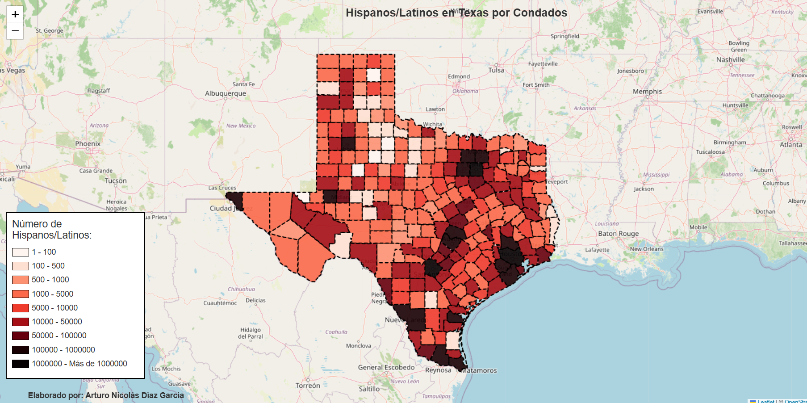

# 🗺️ Geospatial Analysis: US Hispanic Demographics (Decennial Census)

An end-to-end exploratory data analysis (EDA) and geospatial mapping project analyzing the geographical distribution, population density, and demographic concentration of Hispanic and Latino communities across the United States.

---

## 📌 Project Overview

This project processes raw demographic data from the **US Decennial Census** and blends it with state and county shapefiles. Using Python's geospatial stack (`GeoPandas`, `Shapely`, `Folium`), the raw census variables were cleaned, standardized, and projected to uncover regional demographic concentrations and settlement patterns.

### Key Objectives:
* Clean and transform raw decennial census datasets.
* Join demographic metrics with US spatial boundaries (TIGER/Line shapefiles).
* Build choropleth maps and spatial visualizations to analyze geographic distribution at state and county levels.

---

## 🛠️ Tech Stack & Libraries

* **Data Processing & Manipulation:** `Python`, `Pandas`
* **Geospatial & GIS:** `GeoPandas`, `Shapely`
* **Visualization & Mapping:** `Folium`, `Matplotlib`, `Seaborn`
* **Environment:** `Jupyter Notebook`

---

## 🗂️ Data Pipeline & Methodology

1. **Data Ingestion:**
   * Raw population and ethnicity tables extracted from the US Decennial Census.
   * Spatial geometry datasets (Shapefiles / GeoJSON) for US administrative divisions.

2. **Data Cleaning & Spatial Preprocessing:**
   * Standardized FIPS codes across tabular and geospatial datasets.
   * Handled missing spatial records and normalized population totals into percentage densities.
   * Re-projected coordinate reference systems (CRS) to standard geographic projections (e.g., `EPSG:4326` and `EPSG:3857`).

3. **Geospatial Modeling & Visualization:**
   * Choropleth mapping by demographic density brackets.
   * Interactive layer generation with pop-ups and custom colormaps using `Folium`.

---

## 📊 Visualizations & Maps

> *(Recomendación: Sube capturas de pantalla de tus mapas generados o exportaciones PNG a una carpeta `assets/` o `img/` dentro del repositorio para mostrarlos aquí)*

### Hispanic Population Distribution (Choropleth)

  <!-- Reemplaza esta ruta con la ubicación real de tu captura de mapa -->
  

---

## 💡 Key Analytical Findings

* **Regional Clustering:** High concentration indices remain prominent in historical Southwestern gateway states (California, Texas, Arizona, New Mexico), alongside distinct urban nodes in Florida, New York, and Illinois.
* **Emerging Hubs:** Notable relative growth in suburban and mid-sized metropolitan areas across non-traditional settlement states.
* **Spatial Density vs. Absolute Count:** Normalizing absolute counts by county population reveals high-density rural agricultural corridors that standard aggregated state maps obscure.

---

